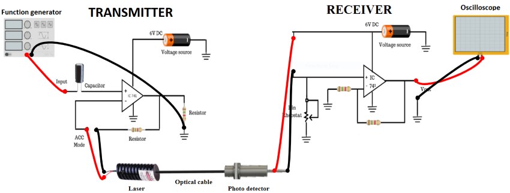

### Introduction

In order to transmit information via an optical fiber communication system it is necessary to modulate a property of light with the information signal. This property may be intensity, frequency, phase with either analog or digital signals. The choices are indicated by the characteristics of optical fiber, the available optical sources and detectors, and the considerations of the overall system.

**Intensity Modulation:** In this system the information signal is used to control the intensity of the source. At the far end, the variation in the amplitude of the received signal is used to recover the original information signal.

The input signal is used to control the current through an LED/LASER which in turn controls the light output. The light is conveyed to the detector I circuit by optic fiber. The detector is a photo transistor which converts the incoming light to a small current which flows through a series resistor. This gives rise to a voltage whose amplitude is controlled by the received light intensity. The voltage is now amplified within the detector circuit and if necessary, amplified further by the amplified circuit.

**Figure 1: Set up for Intensity Modulation of Laser Output through an Optical Fiber**

