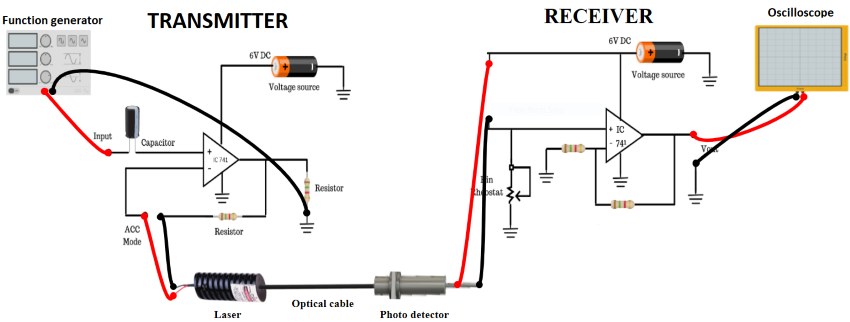

## Procedure 

1.  Connect one end of the PMMA F0 cable to the laser port on the TX unit. The other end is first connected to F0 PIN (on RX unit) to set the carrier power level of the laser. Then it is removed and given to F0 PT (RX unit) to study the response of the IM system.
2.  Switch On the TX unit connect Vin to a function generator (10Hz to 500KHz; sine wave output, 10mV to 2000 mV p-p output) The Black lead is ground. Give the function generator output to CH1, as shown.
3.  Switch On the RX unit; connect Vout to CH2 of the dual trace oscilloscope. Connect the Black lead to ground.
4.  Plug the AC mains for both systems.
5.  By changing the signal frequency and amplitude respectively. Observe the transmitted and received signals on the oscilloscope.
6.  Tabulate and plot the graph between (Vin) and (Vo).

**Figure 1: Set up for Intensity Modulation of Laser Output through an Optical Fiber**

